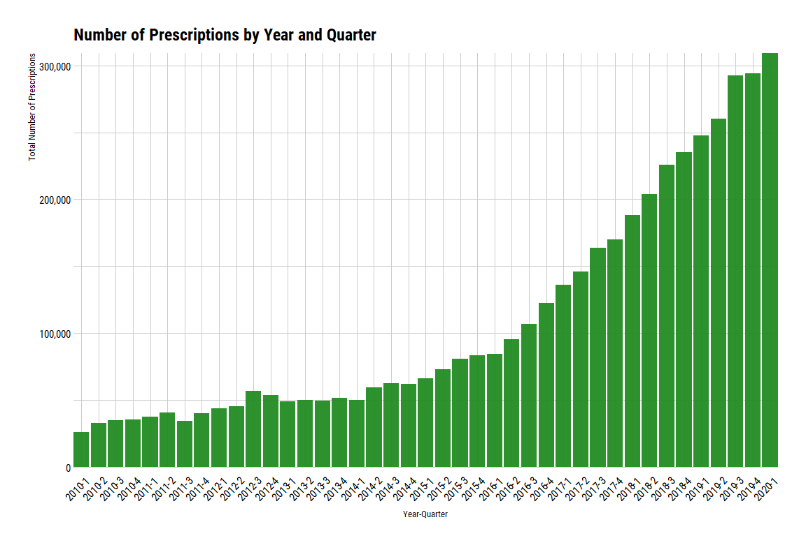
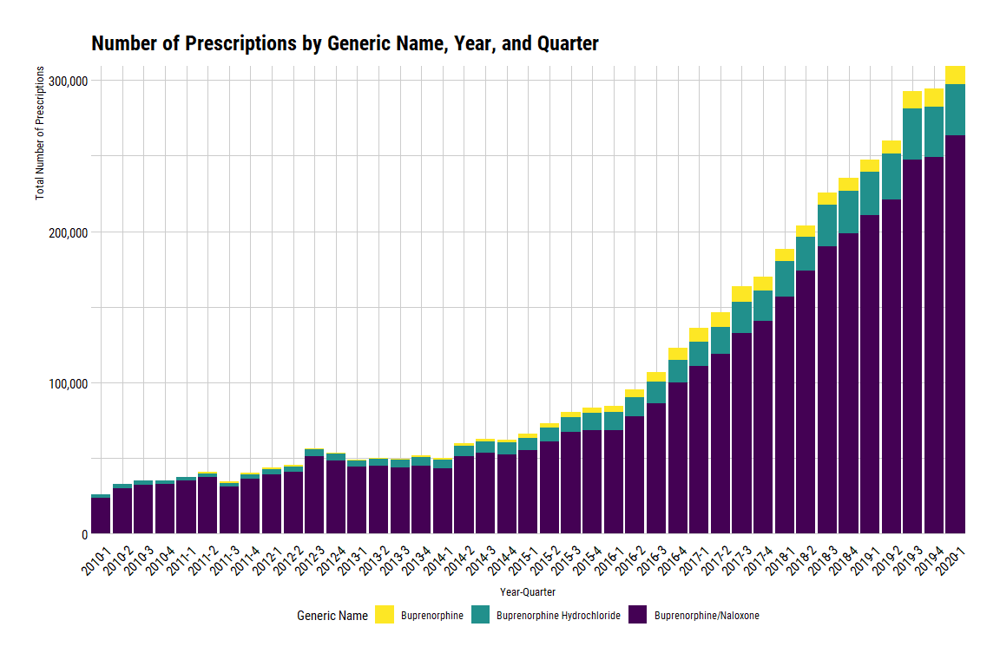
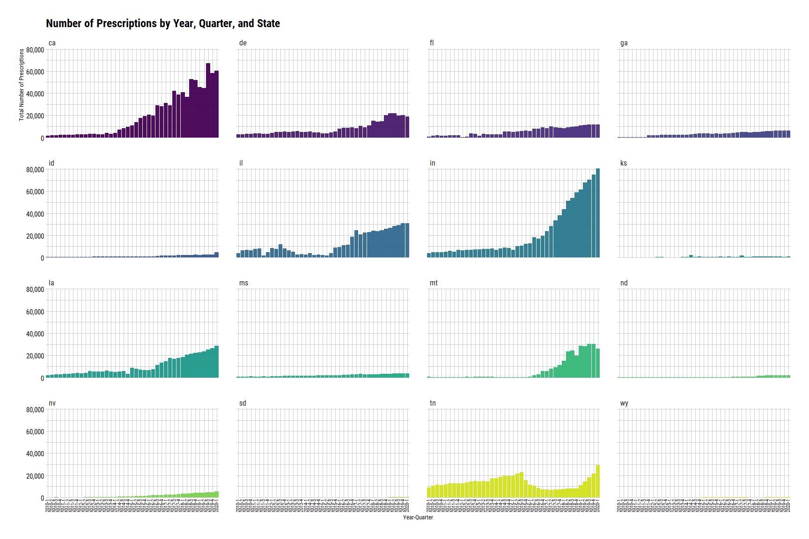

Buprenorphine Q1 2010 - Q1 2020
================
Michael Maguire, MS
3/18/2021

### Load libraries

``` r
library(dplyr)
```

    ## Warning: package 'dplyr' was built under R version 4.0.4

``` r
library(ggplot2)
library(hrbrthemes)
library(purrr)
library(readr)
library(readxl)
library(stringr)
library(tidylog)
library(viridis)
```

### Step 1: Read in SK’s data set with drug names.

``` r
drugs <-
  read_xlsx(
    path = "./data/raw/Buprenorphine drug names_SK.xlsx",
    .name_repair = "universal"
  )
```

    ## New names:
    ## * `Drug name` -> Drug.name

``` r
drugs_vec <-
  drugs$Drug.name

drugs_vec
```

    ##  [1] "Belbuca"                                             
    ##  [2] "Bunavail"                                            
    ##  [3] "Buprenex"                                            
    ##  [4] "Buprenorphine"                                       
    ##  [5] "Buprenorphine and Naloxone"                          
    ##  [6] "Buprenorphine and Naloxone AvPak"                    
    ##  [7] "Buprenorphine and Naloxone Sublingual Film"          
    ##  [8] "Buprenorphine and Naloxone Sublingual Tablets USP 42"
    ##  [9] "Buprenorphine HCl"                                   
    ## [10] "Buprenorphine Hydrochloride"                         
    ## [11] "Buprenorphine-Naloxone"                              
    ## [12] "Buprenorphine-Naloxone Film"                         
    ## [13] "Butrans"                                             
    ## [14] "Cassipa"                                             
    ## [15] "Probuphine"                                          
    ## [16] "Sublocade"                                           
    ## [17] "Sublocade 100MG"                                     
    ## [18] "Sublocade 300MG"                                     
    ## [19] "Suboxone"                                            
    ## [20] "Subutex"                                             
    ## [21] "Zubsolv"

### Step 2: Get the states that SK requested.

``` r
sk_states <- 
  data.frame(
    state = c(
      "California", "Delaware", "Georgia", "Illinois", "Florida", "Idaho", "Indiana", "Kansas", "Louisiana",
      "Mississippi", "Montana", "Nevada", "North Dakota", "South Dakota", "Wyoming", "Tennessee"
    )
  )

states <-
  bind_cols(
    state.name,
    tolower(state.abb)
  ) %>%
  rename(state = `...1`, abb = `...2`)
```

    ## New names:
    ## * NA -> ...1
    ## * NA -> ...2

    ## rename: renamed 2 variables (state, abb)

``` r
states
```

    ## # A tibble: 50 x 2
    ##    state       abb  
    ##    <chr>       <chr>
    ##  1 Alabama     al   
    ##  2 Alaska      ak   
    ##  3 Arizona     az   
    ##  4 Arkansas    ar   
    ##  5 California  ca   
    ##  6 Colorado    co   
    ##  7 Connecticut ct   
    ##  8 Delaware    de   
    ##  9 Florida     fl   
    ## 10 Georgia     ga   
    ## # ... with 40 more rows

``` r
states_req <-
  states %>%
    inner_join(sk_states, by = "state") %>%
  select(abb)
```

    ## inner_join: added no columns

    ##             > rows only in x  (34)

    ##             > rows only in y  ( 0)

    ##             > matched rows     16

    ##             >                 ====

    ##             > rows total       16

    ## select: dropped one variable (state)

``` r
state_vec <-
  as_vector(states_req)

state_vec
```

    ##  abb1  abb2  abb3  abb4  abb5  abb6  abb7  abb8  abb9 abb10 abb11 abb12 abb13 
    ##  "ca"  "de"  "fl"  "ga"  "id"  "il"  "in"  "ks"  "la"  "ms"  "mt"  "nv"  "nd" 
    ## abb14 abb15 abb16 
    ##  "sd"  "tn"  "wy"

### Step 3: Pull in SDUD dataset.

Note: location of data set is a personal directory, so I have masked it.

``` r
sdud_2010_2020 <-
  read_rds(
    file = loc
  ) %>%
  filter(state %in% state_vec & (year %in% c(2010:2019) | year == 2020 & quarter == 1))
```

    ## filter: removed 51,392,212 rows (81%), 12,325,019 rows remaining

Examine years and quarters to ensure the correct period is pulled.

``` r
sdud_2010_2020 %>%
  distinct(year, quarter) %>%
  arrange(year, desc(quarter))
```

    ## distinct: removed 12,324,978 rows (>99%), 41 rows remaining

    ## # A tibble: 41 x 2
    ##     year quarter
    ##    <int>   <int>
    ##  1  2010       4
    ##  2  2010       3
    ##  3  2010       2
    ##  4  2010       1
    ##  5  2011       4
    ##  6  2011       3
    ##  7  2011       2
    ##  8  2011       1
    ##  9  2012       4
    ## 10  2012       3
    ## # ... with 31 more rows

### Step 4: Flag records containing generic name.

``` r
sdud_2010_2020_gennmes <- 
  sdud_2010_2020 %>%
  mutate(
    buprenorphine_flag = case_when(
      str_detect(string = gennme_c, pattern = regex("buprenorphine", ignore_case = TRUE)) ~ "1",
      TRUE ~ "0"
    )
  )
```

    ## mutate: new variable 'buprenorphine_flag' (character) with 2 unique values and 0% NA

Checking flags.

``` r
sdud_2010_2020_gennmes %>%
  select(buprenorphine_flag) %>%
  map(., janitor::tabyl)
```

    ## select: dropped 32 variables (utilization_type, state, year, quarter, number_of_prescriptions, …)

    ## $buprenorphine_flag
    ##  .x[[i]]        n     percent
    ##        0 12303471 0.998251686
    ##        1    21548 0.001748314

### Step 5: Aggregate by state, year, quarter and sum.

``` r
# Filter off on flags created above.
sdud_2010_2020_bup_flags <-
  sdud_2010_2020_gennmes %>%
  filter(
    buprenorphine_flag == "1"
  )
```

    ## filter: removed 12,303,471 rows (>99%), 21,548 rows remaining

``` r
# Create data set containing generic name, brand name, and ndc number.
ndc_gen_brand_names <- 
  sdud_2010_2020_bup_flags %>%
  distinct(gennme_c, prodnme, ndc)
```

    ## distinct: removed 21,417 rows (99%), 131 rows remaining

``` r
# Examine data set.
ndc_gen_brand_names
```

    ## # A tibble: 131 x 3
    ##    ndc         gennme_c                    prodnme               
    ##    <chr>       <chr>                       <chr>                 
    ##  1 00054017713 Buprenorphine Hydrochloride BUPRENORPHINE         
    ##  2 00093365840 Buprenorphine               BUPRENORPHINE         
    ##  3 12496120203 Buprenorphine/Naloxone      SUBOXONE              
    ##  4 00093365640 Buprenorphine               BUPRENORPHINE         
    ##  5 00228315303 Buprenorphine Hydrochloride BUPRENORPHINE         
    ##  6 00228315503 Buprenorphine/Naloxone      BUPRENORPHINE-NALOXONE
    ##  7 12496120403 Buprenorphine/Naloxone      SUBOXONE              
    ##  8 59385002160 Buprenorphine               BELBUCA               
    ##  9 42858058640 Buprenorphine               BUPRENORPHINE         
    ## 10 59011075204 Buprenorphine               BUTRANS               
    ## # ... with 121 more rows

``` r
# Create aggregate by state, year, quarter, and suppression.
sdud_2010_2020_bup_rx <-
  sdud_2010_2020_bup_flags %>%
  group_by(state, year, quarter, gennme_c, suppression_used) %>%
  summarize(total_prescriptions = sum(number_of_prescriptions))
```

    ## group_by: 5 grouping variables (state, year, quarter, gennme_c, suppression_used)

    ## summarize: now 3,306 rows and 6 columns, 4 group variables remaining (state, year, quarter, gennme_c)

``` r
# Create aggregate by state, year, quarter, generic name, and suppression. 
sdud_2010_2020_bup <- 
  sdud_2010_2020_bup_flags %>%
  group_by(state, year, quarter, suppression_used) %>%
  summarize(total_prescriptions = sum(number_of_prescriptions))
```

    ## group_by: 4 grouping variables (state, year, quarter, suppression_used)

    ## summarize: now 1,289 rows and 5 columns, 3 group variables remaining (state, year, quarter)

### Step 6: Plot number of prescriptions over time.

``` r
# Plot showing number of prescriptions by year and quarter.
ggplot(data = sdud_2010_2020_bup) +
  geom_col(aes(x = paste0(year, "-", quarter), y = total_prescriptions), fill = "forestgreen", alpha = 0.95) +
  scale_y_continuous(labels = scales::comma) + 
  theme_ipsum_rc(axis_title_just = "ct") +
  ggtitle("Number of Prescriptions by Year and Quarter") +
  xlab("Year-Quarter") +
  ylab("Total Number of Prescriptions") +
  theme(
    axis.text.x = element_text(color = "black", angle = 45, vjust = 0.5, hjust = 0.75),
    axis.text.y = element_text(color = "black"),
    axis.title.x = element_text(color = "black", size = 10, vjust = -4),
    axis.title.y = element_text(color = "black", size = 10),
  ) +
  coord_cartesian(expand = FALSE)
```

<!-- -->

``` r
# Plot showing number of prescriptions by year, quarter, and generic name.
ggplot(data = sdud_2010_2020_bup_rx) +
  geom_col(aes(x = paste0(year, "-", quarter), y = total_prescriptions, fill = gennme_c)) +
  scale_fill_viridis_d(direction = -1) +
  scale_y_continuous(labels = scales::comma) +
  theme_ipsum_rc(axis_title_just = "ct") +
  ggtitle("Number of Prescriptions by Generic Name, Year, and Quarter") +
  xlab("Year-Quarter") +
  ylab("Total Number of Prescriptions") +
  labs(fill = "Generic Name") +
  theme(
    axis.text.x = element_text(color = "black", angle = 45, vjust = 0.5, hjust = 0.75),
    axis.text.y = element_text(color = "black"),
    axis.title.x = element_text(color = "black", size = 10, vjust = -4),
    axis.title.y = element_text(color = "black", size = 10),
    legend.position = "bottom"
  ) +
  coord_cartesian(expand = FALSE)
```

<!-- -->

``` r
# Plot showing number of prescriptions by year, quarter, and state.
ggplot(data = sdud_2010_2020_bup) +
  geom_col(aes(x = paste0(year, "-", quarter), y = total_prescriptions, fill = state), alpha = 0.95) +
  scale_fill_viridis_d() +
  scale_y_continuous(labels = scales::comma) + 
  theme_ipsum_rc(axis_title_just = "ct") +
  ggtitle("Number of Prescriptions by Year, Quarter, and State") +
  xlab("Year-Quarter") +
  ylab("Total Number of Prescriptions") +
  theme(
    axis.text.x = element_text(color = "black", angle = 90, size = 8, hjust = 0.25, vjust = 0.25),
    axis.text.y = element_text(color = "black"),
    axis.title.x = element_text(color = "black", size = 10),
    axis.title.y = element_text(color = "black", size = 10),
    legend.position = "none"
  ) +
  facet_wrap(~state) +
  coord_cartesian(expand = FALSE)
```

<!-- -->
