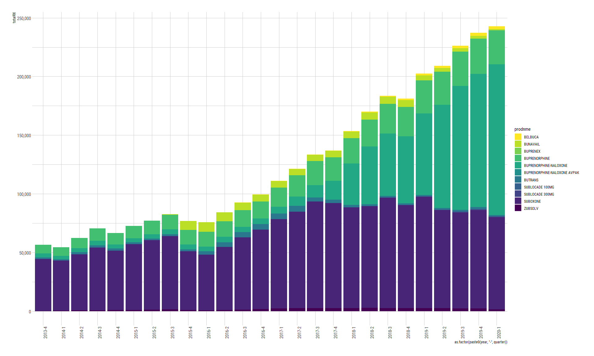

Buprenoprhine 2013Q4 - 2020Q1
================
Michael Quinn Maguire, MS
2/9/2022

## Packages Used

``` r
library(data.table)
library(hrbrthemes)
library(tidyverse)
library(tidylog)
```

## Create ‘state’ data frame and vectorize the results.

``` r
skStates <- setNames(
  as.data.table(
    c('Alabama', 'Florida', 'Idaho', 'Indiana', 'Kansas', 'Louisiana', 'Mississippi', 'Montana',
      'Nebraska', 'Nevada', 'North Carolina', 'North Dakota', 'South Dakota', 'Tennessee', 'Wyoming'
      )
    ),
  "state")

statesAbb <- setNames(as.data.table(cbind(state.name, state.abb)), c("state", "abbreviation"))

skFinal <-
  statesAbb[skStates, on = .(state = state)]

statesOfInterest <- skFinal$abbreviation

skFinal
```

    ##              state abbreviation
    ##  1:        Alabama           AL
    ##  2:        Florida           FL
    ##  3:          Idaho           ID
    ##  4:        Indiana           IN
    ##  5:         Kansas           KS
    ##  6:      Louisiana           LA
    ##  7:    Mississippi           MS
    ##  8:        Montana           MT
    ##  9:       Nebraska           NE
    ## 10:         Nevada           NV
    ## 11: North Carolina           NC
    ## 12:   North Dakota           ND
    ## 13:   South Dakota           SD
    ## 14:      Tennessee           TN
    ## 15:        Wyoming           WY

## Read in SDUD file

> Note: SDUD file is masked.

``` r
sdud <- fread(
  file_location,
  colClasses = c("proper_ndc" = "character")
)

sdud
```

    ##            proper_ndc utilization.type year quarter state suppression numberrx
    ##        1: 00002010102             FFSU 2013       4    TN           T        0
    ##        2: 00002010102             FFSU 2014       1    TN           T        0
    ##        3: 00002010102             MCOU 2019       4    TN           T        0
    ##        4: 00002010102             FFSU 2019       4    TN           T        0
    ##        5: 00002010102             MCOU 2019       1    TN           T        0
    ##       ---                                                                     
    ## 66791298: 99207086508             FFSU 2007       3    IL           T        0
    ## 66791299: 99207086508             FFSU 2007       3    NE           T        0
    ## 66791300: 99207086508             FFSU 2007       3    KY           T        0
    ## 66791301: 99207086508             FFSU 2007       1    KY           T        0
    ## 66791302: 99207086508             FFSU 2009       1    SC           T        0
    ##           seqidall seqidndc deaclas generid maintin prodcat siglsrc genind
    ##        1: 33435948   100748       7  999999       3       8       N      6
    ##        2: 36334109   100748       7  999999       3       8       N      6
    ##        3: 57741777   100748       7  999999       3       8       N      6
    ##        4: 57777677   100748       7  999999       3       8       N      6
    ##        5: 61976886   100748       7  999999       3       8       N      6
    ##       ---                                                                 
    ## 66791298: 16529953    55094       7  117166       4       7       N      6
    ## 66791299: 16586913    55094       7  117166       4       7       N      6
    ## 66791300: 16674808    55094       7  117166       4       7       N      6
    ## 66791301: 16909363    55094       7  117166       4       7       N      6
    ## 66791302: 21139053    55094       7  117166       4       7       N      6
    ##           desidrg mastfrm pkqtycd thercls thergrp pksize    therdtl
    ##        1:       N     ECT      EA     101      13    100 4004010030
    ##        2:       N     ECT      EA     101      13    100 4004010030
    ##        3:       N     ECT      EA     101      13    100 4004010030
    ##        4:       N     ECT      EA     101      13    100 4004010030
    ##        5:       N     ECT      EA     101      13    100 4004010030
    ##       ---                                                          
    ## 66791298:       N     SHA      EA     201      26      1 8432010030
    ## 66791299:       N     SHA      EA     201      26      1 8432010030
    ## 66791300:       N     SHA      EA     201      26      1 8432010030
    ## 66791301:       N     SHA      EA     201      26      1 8432010030
    ## 66791302:       N     SHA      EA     201      26      1 8432010030
    ##                          gnindds        metsize         maintds strngth
    ##        1: Over the counter (OTC)       EA 00100 Primarily acute  7.5 GR
    ##        2: Over the counter (OTC)       EA 00100 Primarily acute  7.5 GR
    ##        3: Over the counter (OTC)       EA 00100 Primarily acute  7.5 GR
    ##        4: Over the counter (OTC)       EA 00100 Primarily acute  7.5 GR
    ##        5: Over the counter (OTC)       EA 00100 Primarily acute  7.5 GR
    ##       ---                                                              
    ## 66791298: Over the counter (OTC) 000236.0000 ML  ~Missing/Other      5%
    ## 66791299: Over the counter (OTC) 000236.0000 ML  ~Missing/Other      5%
    ## 66791300: Over the counter (OTC) 000236.0000 ML  ~Missing/Other      5%
    ## 66791301: Over the counter (OTC) 000236.0000 ML  ~Missing/Other      5%
    ## 66791302: Over the counter (OTC) 000236.0000 ML  ~Missing/Other      5%
    ##               prdctds                   thrdtds                mstfmds
    ##        1: OTC/Generic Ammonium Chloride & Comb. Tablet, Enteric Coated
    ##        2: OTC/Generic Ammonium Chloride & Comb. Tablet, Enteric Coated
    ##        3: OTC/Generic Ammonium Chloride & Comb. Tablet, Enteric Coated
    ##        4: OTC/Generic Ammonium Chloride & Comb. Tablet, Enteric Coated
    ##        5: OTC/Generic Ammonium Chloride & Comb. Tablet, Enteric Coated
    ##       ---                                                             
    ## 66791298:   OTC/Trade     Coal Tar & Comb., S/M                Shampoo
    ## 66791299:   OTC/Trade     Coal Tar & Comb., S/M                Shampoo
    ## 66791300:   OTC/Trade     Coal Tar & Comb., S/M                Shampoo
    ## 66791301:   OTC/Trade     Coal Tar & Comb., S/M                Shampoo
    ## 66791302:   OTC/Trade     Coal Tar & Comb., S/M                Shampoo
    ##                                  thrclds                      thrgrds deaclds
    ##        1:         Acidifying Agents, NEC Electrolytic, Caloric, Water     OTC
    ##        2:         Acidifying Agents, NEC Electrolytic, Caloric, Water     OTC
    ##        3:         Acidifying Agents, NEC Electrolytic, Caloric, Water     OTC
    ##        4:         Acidifying Agents, NEC Electrolytic, Caloric, Water     OTC
    ##        5:         Acidifying Agents, NEC Electrolytic, Caloric, Water     OTC
    ##       ---                                                                    
    ## 66791298: Keratoplastic Agents S/MM, NEC       Skin & Mucous Membrane     OTC
    ## 66791299: Keratoplastic Agents S/MM, NEC       Skin & Mucous Membrane     OTC
    ## 66791300: Keratoplastic Agents S/MM, NEC       Skin & Mucous Membrane     OTC
    ## 66791301: Keratoplastic Agents S/MM, NEC       Skin & Mucous Membrane     OTC
    ## 66791302: Keratoplastic Agents S/MM, NEC       Skin & Mucous Membrane     OTC
    ##                             prodnme            gennme
    ##        1: AMMONIUM CHLORIDE TABLETS Ammonium Chloride
    ##        2: AMMONIUM CHLORIDE TABLETS Ammonium Chloride
    ##        3: AMMONIUM CHLORIDE TABLETS Ammonium Chloride
    ##        4: AMMONIUM CHLORIDE TABLETS Ammonium Chloride
    ##        5: AMMONIUM CHLORIDE TABLETS Ammonium Chloride
    ##       ---                                            
    ## 66791298:  PENTRAX MAXIMUM STRENGTH          Coal Tar
    ## 66791299:  PENTRAX MAXIMUM STRENGTH          Coal Tar
    ## 66791300:  PENTRAX MAXIMUM STRENGTH          Coal Tar
    ## 66791301:  PENTRAX MAXIMUM STRENGTH          Coal Tar
    ## 66791302:  PENTRAX MAXIMUM STRENGTH          Coal Tar

## Create an initial aggregation without quarters.

``` r
yrSt <-
  sdud[
    i = year %in% c(2013:2020) & state %in% statesOfInterest & str_detect(gennme, pattern = "Buprenorphine"),
    j = .(utilization.type, strngth, mstfmds, year, proper_ndc, quarter, state, suppression, numberrx, prodnme, gennme)
  ]

setorder(yrSt, state, year, quarter, proper_ndc)

yrSt
```

    ##        utilization.type     strngth mstfmds year  proper_ndc quarter state
    ##     1:             FFSU        2 MG  Tablet 2013 00054017613       1    AL
    ##     2:             FFSU        8 MG  Tablet 2013 00054017713       1    AL
    ##     3:             FFSU        2 MG  Tablet 2013 00093537856       1    AL
    ##     4:             FFSU        8 MG  Tablet 2013 00093537956       1    AL
    ##     5:             FFSU   8 MG-2 MG  Tablet 2013 00228315503       1    AL
    ##    ---                                                                    
    ## 18432:             FFSU     450 MCG    Film 2020 59385002460       4    WY
    ## 18433:             FFSU 2 MG-0.5 MG  Tablet 2020 62175045232       4    WY
    ## 18434:             FFSU 2 MG-0.5 MG  Tablet 2020 62756096983       4    WY
    ## 18435:             FFSU   8 MG-2 MG  Tablet 2020 62756097083       4    WY
    ## 18436:             FFSU   8 MG-2 MG  Tablet 2020 65162041503       4    WY
    ##        suppression numberrx                prodnme                      gennme
    ##     1:           T        0          BUPRENORPHINE Buprenorphine Hydrochloride
    ##     2:           F      169          BUPRENORPHINE Buprenorphine Hydrochloride
    ##     3:           T        0          BUPRENORPHINE Buprenorphine Hydrochloride
    ##     4:           T        0          BUPRENORPHINE Buprenorphine Hydrochloride
    ##     5:           T        0 BUPRENORPHINE-NALOXONE      Buprenorphine/Naloxone
    ##    ---                                                                        
    ## 18432:           T        0                BELBUCA               Buprenorphine
    ## 18433:           T        0 BUPRENORPHINE-NALOXONE      Buprenorphine/Naloxone
    ## 18434:           T        0 BUPRENORPHINE-NALOXONE      Buprenorphine/Naloxone
    ## 18435:           T        0 BUPRENORPHINE-NALOXONE      Buprenorphine/Naloxone
    ## 18436:           T        0 BUPRENORPHINE-NALOXONE      Buprenorphine/Naloxone

## Check brand names.

``` r
unique(yrSt$prodnme, by = 'prodnme')
```

    ##  [1] "BUPRENORPHINE"                "BUPRENORPHINE-NALOXONE"      
    ##  [3] "BUPRENEX"                     "SUBOXONE"                    
    ##  [5] "BUTRANS"                      "BUPRENORPHINE HYDROCHLORIDE" 
    ##  [7] "ZUBSOLV"                      "BUNAVAIL"                    
    ##  [9] "BELBUCA"                      "SUBLOCADE 300MG"             
    ## [11] "SUBLOCADE 100MG"              "BUPRENORPHINE-NALOXONE AVPAK"
    ## [13] "PROBUPHINE"                   "SUBUTEX"

## Create variables representing whether row is in requested date range or not.

``` r
yrStRange <- yrSt[
    i = ,
    j = `:=` (inRange = ifelse((year == 2013 & quarter < 4) | (year == 2020 & quarter > 1), 0, 1), yearqtr = paste0(year, '-', quarter))
  ]

yrStRange
```

## Running some checks to ensure that correct dates are being pulled

``` r
yrStRange |>
  janitor::tabyl(inRange)
```

    ##  inRange     n   percent
    ##        0  3629 0.1968431
    ##        1 14807 0.8031569

``` r
yrStRange |>
  filter(inRange == 1) |>
  distinct(yearqtr)
```

    ## filter: removed 3,629 rows (20%), 14,807 rows remaining

    ## distinct: removed 14,781 rows (>99%), 26 rows remaining

    ##     yearqtr
    ##  1:  2013-4
    ##  2:  2014-1
    ##  3:  2014-2
    ##  4:  2014-3
    ##  5:  2014-4
    ##  6:  2015-1
    ##  7:  2015-2
    ##  8:  2015-3
    ##  9:  2015-4
    ## 10:  2016-1
    ## 11:  2016-2
    ## 12:  2016-3
    ## 13:  2016-4
    ## 14:  2017-1
    ## 15:  2017-2
    ## 16:  2017-3
    ## 17:  2017-4
    ## 18:  2018-1
    ## 19:  2018-2
    ## 20:  2018-3
    ## 21:  2018-4
    ## 22:  2019-1
    ## 23:  2019-2
    ## 24:  2019-3
    ## 25:  2019-4
    ## 26:  2020-1
    ##     yearqtr

``` r
yrStRange |>
  filter(inRange == 0) |>
  distinct(yearqtr)
```

    ## filter: removed 14,807 rows (80%), 3,629 rows remaining

    ## distinct: removed 3,623 rows (>99%), 6 rows remaining

    ##    yearqtr
    ## 1:  2013-1
    ## 2:  2013-2
    ## 3:  2013-3
    ## 4:  2020-2
    ## 5:  2020-3
    ## 6:  2020-4

## Create the aggregated data set

``` r
drugsAggStateProdnmeRange <- yrStRange[
    i = inRange == 1,
    j  = .(totalRX = sum(numberrx)),
    by = c("utilization.type", "year", "state", "quarter", "gennme", "prodnme", "strngth", "mstfmds", "suppression")
  ]

drugsAggStateProdnmeRange
```

    ##        utilization.type year state quarter                      gennme
    ##     1:             FFSU 2013    AL       4 Buprenorphine Hydrochloride
    ##     2:             FFSU 2013    AL       4 Buprenorphine Hydrochloride
    ##     3:             FFSU 2013    AL       4 Buprenorphine Hydrochloride
    ##     4:             FFSU 2013    AL       4      Buprenorphine/Naloxone
    ##     5:             FFSU 2013    AL       4 Buprenorphine Hydrochloride
    ##    ---                                                                
    ## 10642:             FFSU 2020    WY       1               Buprenorphine
    ## 10643:             FFSU 2020    WY       1               Buprenorphine
    ## 10644:             FFSU 2020    WY       1               Buprenorphine
    ## 10645:             FFSU 2020    WY       1               Buprenorphine
    ## 10646:             FFSU 2020    WY       1      Buprenorphine/Naloxone
    ##                       prodnme      strngth                 mstfmds suppression
    ##     1:          BUPRENORPHINE         2 MG                  Tablet           T
    ##     2:          BUPRENORPHINE         8 MG                  Tablet           F
    ##     3:          BUPRENORPHINE         8 MG                  Tablet           T
    ##     4: BUPRENORPHINE-NALOXONE    8 MG-2 MG                  Tablet           F
    ##     5:               BUPRENEX  0.3 MG/1 ML                Solution           T
    ##    ---                                                                        
    ## 10642:                BUTRANS 7.5 MCG/1 HR Patch, Extended Release           T
    ## 10643:                BUTRANS  15 MCG/1 HR Patch, Extended Release           T
    ## 10644:                BELBUCA      300 MCG                    Film           T
    ## 10645:                BELBUCA      450 MCG                    Film           T
    ## 10646: BUPRENORPHINE-NALOXONE    8 MG-2 MG                  Tablet           T
    ##        totalRX
    ##     1:       0
    ##     2:     284
    ##     3:       0
    ##     4:     143
    ##     5:       0
    ##    ---        
    ## 10642:       0
    ## 10643:       0
    ## 10644:       0
    ## 10645:       0
    ## 10646:       0

## Plot total prescriptions by year, quarter, and generic name.

``` r
drugsAggStateProdnmeRange |> filter(suppression == 'F') |>
ggplot() +
  geom_col(
    aes(
      x = as.factor(paste0(year, '-', quarter)),
      y = totalRX,
      fill = gennme
    )
  ) +
  theme_ipsum_rc() +
  theme(
    axis.text.x = element_text(angle = 90)
  ) + 
  scale_y_continuous(labels = scales::comma) +
  scale_fill_viridis_d(direction = -1)
```

    ## filter: removed 6,357 rows (60%), 4,289 rows remaining

<!-- -->

## Plot total prescriptions by year, quarter, and brand name.

``` r
drugsAggStateProdnmeRange |> filter(suppression == 'F') |>
ggplot() +
  geom_col(
    aes(
      x = as.factor(paste0(year, '-', quarter)),
      y = totalRX,
      fill = prodnme
    )
  ) +
  theme_ipsum_rc() +
  theme(
    axis.text.x = element_text(angle = 90)
  ) + 
  scale_y_continuous(labels = scales::comma) +
  scale_fill_viridis_d(direction = -1)
```

    ## filter: removed 6,357 rows (60%), 4,289 rows remaining

<!-- -->

## Plot total prescriptions by year, quarter, generic name, and state.

``` r
drugsAggStateProdnmeRange |> filter(suppression == 'F') |>
  ggplot() +
  geom_col(
    aes(
      x = as.factor(paste0(year, '-', quarter)),
      y = totalRX,
      fill = gennme
    )
  ) + 
  facet_wrap(~state) +
  theme_ipsum_rc() + 
  theme(axis.text.x = element_text(angle = 90)) +
  scale_y_continuous(labels = scales::comma) +
  scale_fill_viridis_d(direction = -1)
```

    ## filter: removed 6,357 rows (60%), 4,289 rows remaining

<!-- -->

## Plot total prescriptions by year, quarter, brand name, and state.

``` r
drugsAggStateProdnmeRange |> filter(suppression == 'F') |>
  ggplot() +
  geom_col(
    aes(
      x = as.factor(paste0(year, '-', quarter)),
      y = totalRX,
      fill = prodnme
    )
  ) + 
  facet_wrap(~state) +
  theme_ipsum_rc() + 
  theme(axis.text.x = element_text(angle = 90)) +
  scale_y_continuous(labels = scales::comma) +
  scale_fill_viridis_d(direction = -1)
```

    ## filter: removed 6,357 rows (60%), 4,289 rows remaining

<!-- -->
